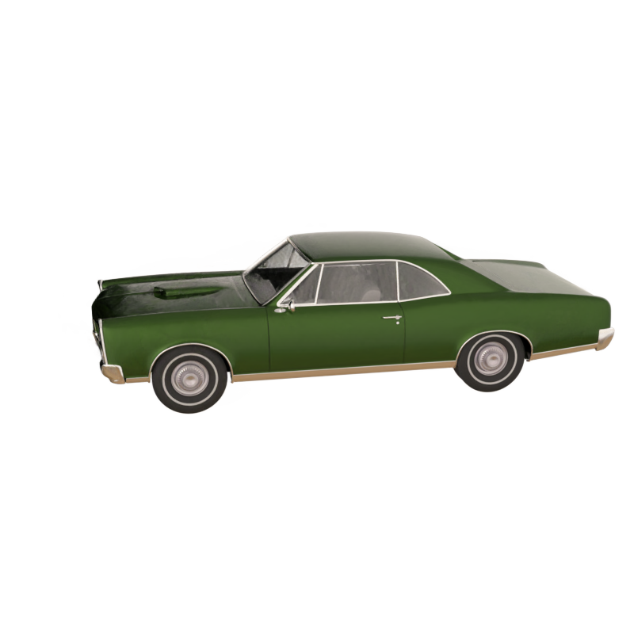
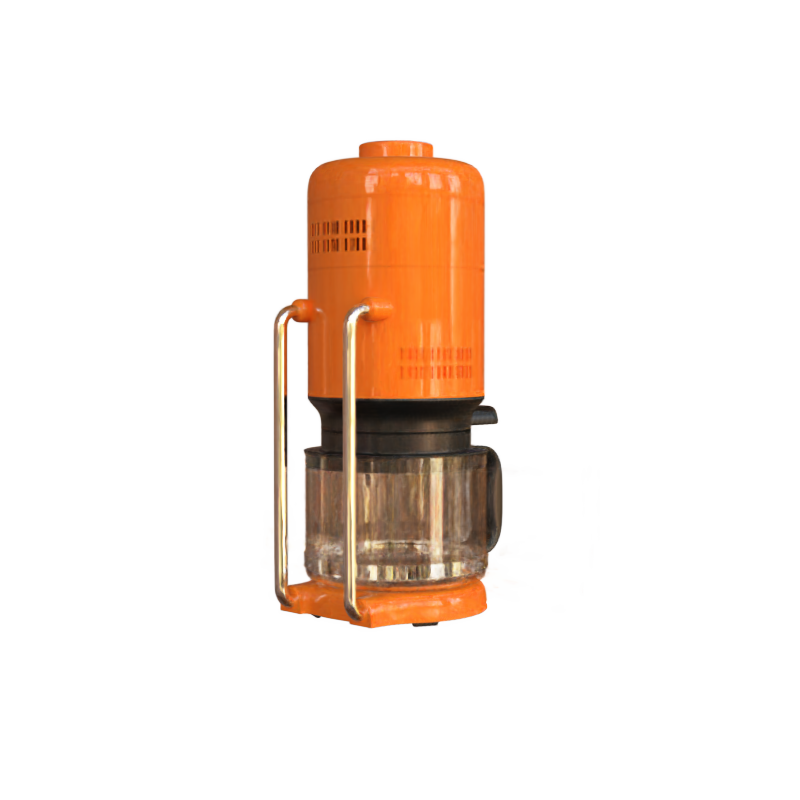

# 赛题二: JitDirectVoxGO

|  |  |
|:-:|:-:|
|||


## 简介

本项目包含了第二届计图挑战赛计图 - 可微渲染新视角生成赛题的代码实现。本项目的特点是：实现了DirectVoxGo 方法的Jittor版本，针对场景特点调整训练超参。

## 安装 

本项目可在 2 张 RTX 3090 上运行，根据不同的训练设置，训练时间从5分钟到8个小时不等。

#### 运行环境
- ubuntu 20.04 LTS
- python >= 3.7
- jittor >= 1.3.0

#### 安装依赖
执行以下命令安装 python 依赖
```
pip install -r requirements.txt
```

<details>
  <summary> 具体依赖 </summary>

  - `Jittor`, `numpy`: main computation.
  - `scipy`, `lpips`: SSIM and LPIPS evaluation.
  - `tqdm`: progress bar.
  - `mmcv`: config system.
  - `opencv-python`: image processing.
  - `imageio`, `imageio-ffmpeg`: images and videos I/O.

</details>

## 数据集

将数据下载解压到 `<root>/data` 下，其结构如下：

<details>
  <summary> (click to expand;) </summary>

    data
    ├── nerf_synthetic     # Link: https://drive.google.com/drive/folders/128yBriW1IG_3NJ5Rp7APSTZsJqdJdfc1
    │   └── [chair|drums|ficus|hotdog|lego|materials|mic|ship|Easyship|Car|Coffee|Scar|Scarf]
    │       ├── [train|val|test]
    │       │   └── r_*.png
    │       └── transforms_[train|val|test].json
    │
    ├── Synthetic_NSVF     # Link: https://dl.fbaipublicfiles.com/nsvf/dataset/Synthetic_NSVF.zip
    │   └── [Bike|Lifestyle|Palace|Robot|Spaceship|Steamtrain|Toad|Wineholder]
    │       ├── intrinsics.txt
    │       ├── rgb
    │       │   └── [0_train|1_val|2_test]_*.png
    │       └── pose
    │           └── [0_train|1_val|2_test]_*.txt
    │
    ├── BlendedMVS         # Link: https://dl.fbaipublicfiles.com/nsvf/dataset/BlendedMVS.zip
    │   └── [Character|Fountain|Jade|Statues]
    │       ├── intrinsics.txt
    │       ├── rgb
    │       │   └── [0|1|2]_*.png
    │       └── pose
    │           └── [0|1|2]_*.txt
    │
    ├── TanksAndTemple     # Link: https://dl.fbaipublicfiles.com/nsvf/dataset/TanksAndTemple.zip
    │   └── [Barn|Caterpillar|Family|Ignatius|Truck]
    │       ├── intrinsics.txt
    │       ├── rgb
    │       │   └── [0|1|2]_*.png
    │       └── pose
    │           └── [0|1|2]_*.txt
    │
    ├── deepvoxels         # Link: https://drive.google.com/drive/folders/1ScsRlnzy9Bd_n-xw83SP-0t548v63mPH
    │   └── [train|validation|test]
    │       └── [armchair|cube|greek|vase]
    │           ├── intrinsics.txt
    │           ├── rgb/*.png
    │           └── pose/*.txt
    │
    ├── nerf_llff_data     # Link: https://drive.google.com/drive/folders/128yBriW1IG_3NJ5Rp7APSTZsJqdJdfc1
    │   └── [fern|flower|fortress|horns|leaves|orchids|room|trex]
    │
    ├── tanks_and_temples  # Link: https://drive.google.com/file/d/11KRfN91W1AxAW6lOFs4EeYDbeoQZCi87/view?usp=sharing
    │   └── [tat_intermediate_M60|tat_intermediate_Playground|tat_intermediate_Train|tat_training_Truck]
    │       └── [train|test]
    │           ├── intrinsics/*txt
    │           ├── pose/*txt
    │           └── rgb/*jpg
    │
    ├── lf_data            # Link: https://drive.google.com/file/d/1gsjDjkbTh4GAR9fFqlIDZ__qR9NYTURQ/view?usp=sharing
    │   └── [africa|basket|ship|statue|torch]
    │       └── [train|test]
    │           ├── intrinsics/*txt
    │           ├── pose/*txt
    │           └── rgb/*jpg
    │
    ├── 360_v2             # Link: https://jonbarron.info/mipnerf360/
    │   └── [bicycle|bonsai|counter|garden|kitchen|room|stump]
    │       ├── poses_bounds.npy
    │       └── [images_2|images_4]
    │
    ├── nerf_llff_data     # Link: https://drive.google.com/drive/folders/14boI-o5hGO9srnWaaogTU5_ji7wkX2S7
    │   └── [fern|flower|fortress|horns|leaves|orchids|room|trex]
    │       ├── poses_bounds.npy
    │       └── [images_2|images_4]
    │
    └── co3d               # Link: https://github.com/facebookresearch/co3d
        └── [donut|teddybear|umbrella|...]
            ├── frame_annotations.jgz
            ├── set_lists.json
            └── [129_14950_29917|189_20376_35616|...]
                ├── images
                │   └── frame*.jpg
                └── masks
                    └── frame*.png
</details>

## 训练&推理
 


- Training
    ```bash
    $ python run.py --config configs/comp/Easyship.py --render_val
    ```
- Evaluation
    To only evaluate the valset `PSNR`, `SSIM`, and `LPIPS` of the trained `Easyship` without re-training, run:
    ```bash
    $ python run.py --config configs/comp/Easyship.py --render_val --render_test 
    ```
- Render video
    ```bash
    $ python run.py --config configs/comp/Easyship.py --render_only --render_video

    ```
    Use `--render_video_factor 4` for a fast preview.
- Reproduction: all config files to reproduce our results.
    <details>
        <summary> (click to expand) </summary>
        $ configs/comp:
        Car.py  Coffee.py  Easyship.py  Scar.py  Scarf.py 
        
    </details>

## 致谢

此项目基于论文 Direct Voxel Grid Optimization: Super Fast Convergence for Radiance Fields Reconstruction  实现，部分代码参考了 [DirectVoxGo](https://github.com/sunset1995/DirectVoxGO)。
